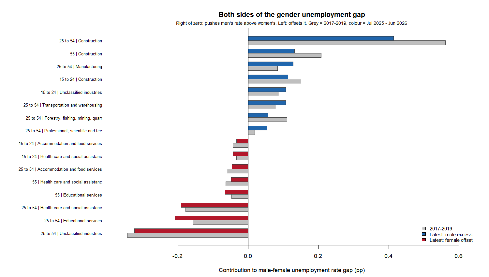
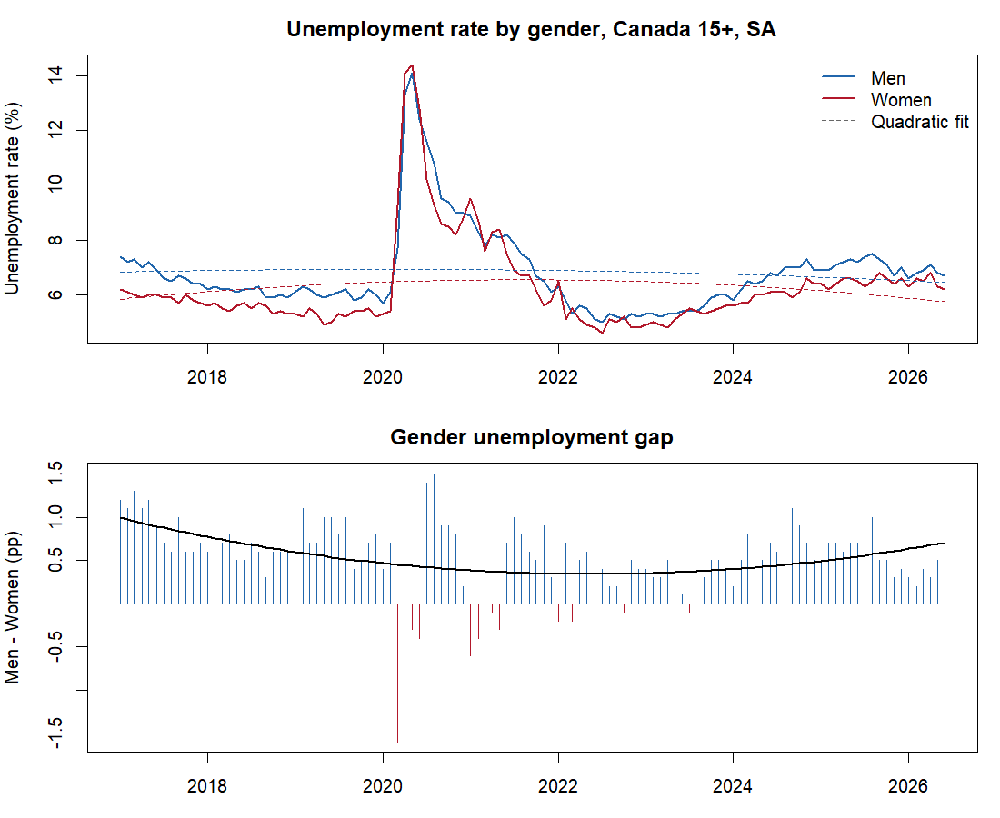
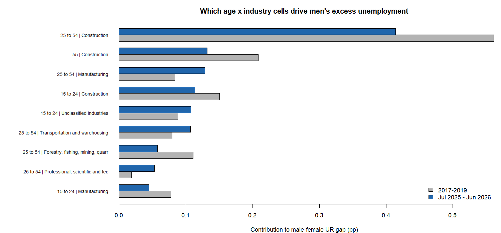

# gender-and-unemployment-rates
Decomposing Canada's gender unemployment gap using LFS data (2017–2026). Quadratic trend models with HAC errors test whether men's unemployment is accelerating relative to women's.

# Gender and Unemployment Rates in Canada

Why do Canadian men have higher unemployment than women? Trend regressions and an
age × industry decomposition of Labour Force Survey data (2017–2026).
**Spoiler: it's mostly construction.**



## The question

Men's unemployment rate in Canada has run above women's for essentially the whole
last decade — about **6.8% vs 6.3%** on average since 2017. This project asks two
things:

1. Is that gap statistically real, and is it growing?
2. *Where* does it come from — which men, in which industries, at which ages?

## Data

Statistics Canada Labour Force Survey (monthly):

| Table | Contents | Used for |
|---|---|---|
| 14-10-0287-01 | Labour force characteristics by gender, 15+, seasonally adjusted, Jan 2017 – Jun 2026 | Trend and gap models |
| 14-10-0022-01 | Labour force characteristics by industry × gender × age, unadjusted, Jan 2017 – Jun 2026 | Decomposition |

Raw exports live in `data/`. All figures are weighted population estimates
(× 1,000), not raw survey counts.

## Part 1 — Is the gap real and is it growing?

`R/01_unemployment_gender_model.R` cleans the StatCan export and fits a quadratic
trend model with a gender dummy (D = 1 for men, women as the reference group):

> UR = β₀ + β₁·Time + β₂·Time² + β₃·D + β₄·(D×Time) + β₅·(D×Time²) + ε

All inference uses **Newey–West (HAC) standard errors** — monthly unemployment
series are strongly autocorrelated, and ordinary standard errors would wildly
overstate significance.



**Results** (full coefficient tables with HAC errors are in
[`R/output/model_main.csv`](R/output/model_main.csv),
[`model_covid_dummy.csv`](R/output/model_covid_dummy.csv),
[`model_post2022.csv`](R/output/model_post2022.csv), and
[`model_gap.csv`](R/output/model_gap.csv)):

- In the raw stacked model, nothing is significant — the 2020 COVID spike
  (unemployment briefly hit ~14%) is so violent that a smooth curve can't fit it,
  drowning every trend coefficient in residual noise.
- The trick is to model the **gap directly**: (Men − Women) each month. The COVID
  shock hit both genders and cancels out of the difference. Then everything
  snaps into focus ([`model_gap.csv`](R/output/model_gap.csv)):
  - the gap starts at **+0.99 pp** in 2017 (men higher, p < 0.001),
  - it **declines** over time (β_time < 0, p < 0.001),
  - with a **positive quadratic** (β_time² > 0, p ≈ 0.0004) — the gap bottomed
    out around mid-2022 and has been **re-widening since**.
- Robustness: adding a COVID dummy recovers a significant male level effect of
  roughly **+1 pp**; a 2022-onward subsample shows the gap starting near zero
  and drifting back up.

So: the male excess is real, it shrank into 2022, and it is growing again. But a
regression on national averages can't say *why*. That's Part 2.

## Part 2 — Where does the gap come from?

`R/02_decomposition.R` breaks the male−female unemployment gap into
**3 age groups × 17 industries** and splits it, Oaxaca-style, into two parts:

- **Composition** — men are over-represented in industries/ages that have high
  unemployment *for everyone* (e.g., lots of men work in construction, and
  construction has high unemployment regardless of gender).
- **Within-cell** — men have higher unemployment than women *inside the same*
  industry-age cell (e.g., male construction workers vs female construction
  workers).

The split uses symmetric weights, so it doesn't depend on which gender is the
baseline, and the two parts add up to the total gap exactly. Computed rates are
validated against StatCan's published rates (max deviation 0.05 pp — pure
rounding). Full cell-level results:
[`R/output/decomposition_cells.csv`](R/output/decomposition_cells.csv).



**Headline findings (latest 12 months, Jul 2025 – Jun 2026):**

- Total gap: **+0.54 pp**. About **two-thirds is composition**, one-third
  within-cell.
- **Core-aged men (25–54) in construction alone contribute ~0.41 pp — roughly
  three-quarters of the entire national gap.** Construction 55+ and 15–24 add
  another ~0.25 pp. Manufacturing and transportation follow far behind.
- In several of those follow-up industries the within-cell term is *negative* —
  men inside manufacturing actually have *lower* unemployment than women in
  manufacturing. Their contribution is purely "more men work there."
- Compared with 2017–2019, the within-cell component **shrank** (0.36 → 0.18 pp)
  while composition's share grew. The recent re-widening is cyclical industries
  doing what cyclical industries do in a slowdown — not men losing ground within
  occupations.

## Reading the final chart (the one at the top)

The diverging chart shows both sides of the ledger at once. **Zero is the
midline.** Every bar is one age × industry cell's contribution to the gap:

- **Blue bars (pointing right)** push men's unemployment rate *above* women's.
- **Red bars (pointing left)** pull in the opposite direction — they offset the
  male excess.
- **Grey partner bars** show where the same cell stood in 2017–2019.

The two sides have very different shapes, and that asymmetry is the finding:
the blue side is a skyscraper (construction) and some sheds; the red side is
spread across many modest bars.

**Why the negative (red) bars can be read as women's strengths:** a cell pulls
the gap negative when women are concentrated somewhere with *low* unemployment.
The biggest red bars — health care and social assistance, educational services —
are sectors where women make up a large share of the workforce and unemployment
is exceptionally low (women's unemployment in health care runs around **1.5%**,
a third of the national rate). These industries are demand-stable: health care
and education don't lay people off when interest rates rise or housing starts
fall. Women's occupational footprint is, in effect, a **portfolio tilted toward
recession-resistant sectors**, while men's is tilted toward boom-bust ones. The
red bars are the mirror image of the blue ones — the same occupational sorting
that burdens men in construction *shelters* women in care and education.

Two honest exceptions to the "strength" reading, so the chart isn't oversold:

1. **Unclassified industries (25–54)** — the largest red bar — is *not* a
   strength. It's unemployed people with no recent job to classify: largely
   labour-market **re-entrants**, disproportionately women returning after
   caregiving gaps. That bar is a genuinely female-specific friction.
2. **Educational services** is a hybrid: mostly a concentration effect, but
   women inside education also run persistently *higher* unemployment than men
   in education (likely the contract/occasional-teacher workforce) — the one
   sizeable cell with a real within-sector female penalty.

Net: the positive cells sum to +1.60 pp and the negative ones to −1.06 pp,
collapsing to the +0.54 pp headline gap. There is far more gendered sorting
happening under the hood than the net number suggests.

## Running it

Requires R with `lmtest` and `sandwich`
(`install.packages(c("lmtest", "sandwich"))`).

```
cd R
Rscript 01_unemployment_gender_model.R   # tidy + summary + trend/gap models
Rscript 02_decomposition.R               # decomposition + charts
```

Outputs (tidy data, coefficient CSVs, charts) are written to `R/output/`.

## Method notes and caveats

- Unemployment rates are computed from employment/unemployment counts, not
  parsed from rounded published rates, and validated against the published ones.
- The unadjusted industry data is aggregated over multi-month windows — never
  compared raw month-to-month — to neutralize seasonality.
- StatCan-suppressed cells ('x', under ~1,500 persons) are treated as zero;
  the bias is negligible at this aggregation.
- LFS assigns unemployed people to the industry of their **last** job, so
  "unemployed construction workers" includes routine seasonal/project churn —
  a different policy problem than long-duration joblessness.
- This is a descriptive decomposition, not a causal analysis: it identifies
  *who carries* the unemployment gap, not what would fix it.

## Licence and attribution

Contains information licensed under the
[Statistics Canada Open Licence](https://www.statcan.gc.ca/en/reference/licence).
Source: Statistics Canada, Tables 14-10-0287-01 and 14-10-0022-01.
